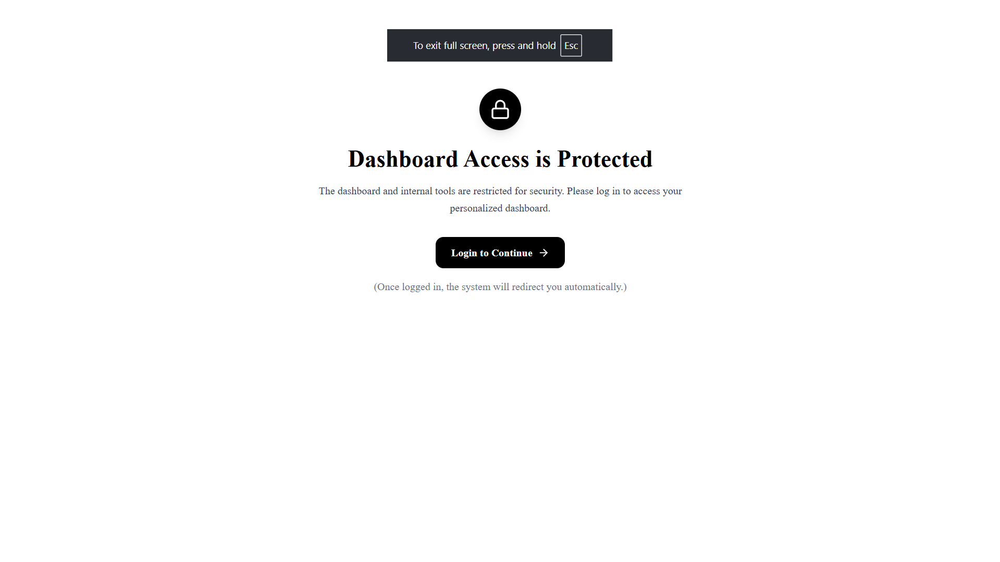
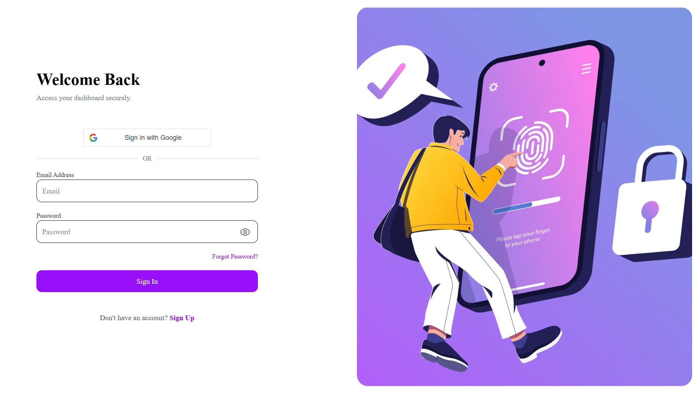
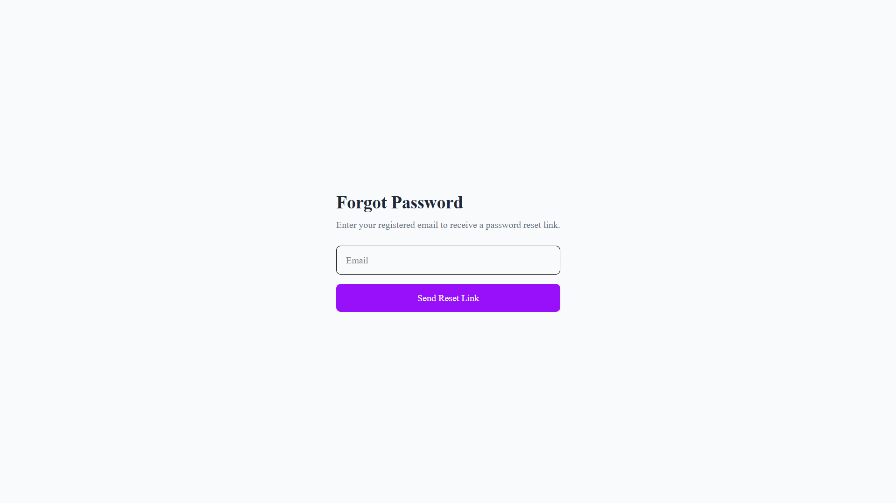
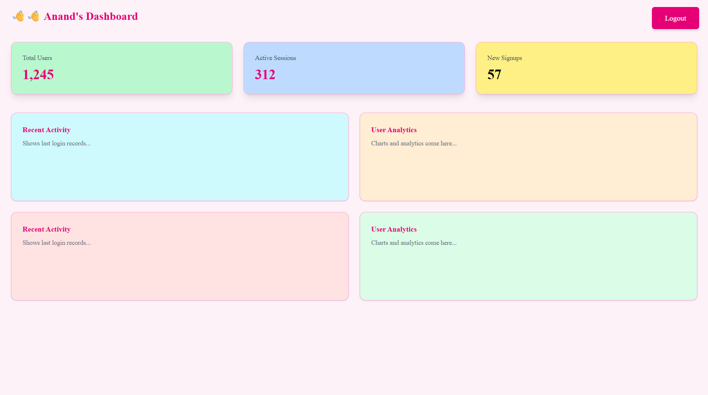

# SRNBS Foundation MERN Authentication System

This is a **full-stack authentication system** built using the MERN (MongoDB, Express, React, Node.js) stack. The application includes secure user authentication, password recovery, social login, and a dashboard with protected routes.

---

## **Features**

- **User Registration:** Secure signup with email and password validation.  
- **Login & Logout:** Authenticate users using JWT and maintain session with cookies.  
- **Forgot Password:** Users can request a password reset email.  
- **Reset Password:** Reset password via a secure token sent to email.  
- **Google OAuth Login:** Users can login using their Google account.  
- **Dashboard:** Protected route accessible only to authenticated users.  
- **JWT Authentication:** Token-based authentication for secure API access.  
- **Protected & Public Routes:** Client-side route guarding for authenticated and unauthenticated users.  
- **Frontend Validation:** Strong password rules enforced on the client side.  
- **Loader & Toast Notifications:** Real-time feedback for better UX.

---

## **Tech Stack**

- **Frontend:** React, React Router DOM, Tailwind CSS, React Hot Toast  
- **Backend:** Node.js, Express.js, MongoDB, Mongoose, JWT, bcrypt  
- **Mail Service** Resend
- **Authentication:** JWT tokens, Google OAuth 2.0  
- **State Management:** Zustand  
- **API Requests:** Axios  

